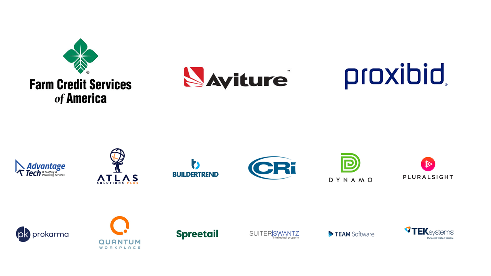

import { Split, SplitRight, Invert } from "mdx-deck/layouts"
import VideoPlayer from "react-simple-video-player"
import { FullScreenCode } from "mdx-deck/layouts"
import { Appear } from "mdx-deck"
import Box from "superbox"
import { CodeSurfer } from "mdx-deck-code-surfer"
import duotoneLight from "prism-react-renderer/themes/duotoneLight"
export { default as theme } from "./theme"
import { Image } from "mdx-deck"

# Bootstrap Your App with AWS Amplify

---



---

export default Invert

## Hello, my name is Mat Warger

- Decade of software experience
- Finance, marketing, insurance, sports industries
- Startups and enterprise
- Currently @KeyholeSoftware in Kansas City
- Co-organizer JSKC
- Organizer @GraphQLKC

---


---

# What is Amplify?

### Toolchain and Libraries

<ul>
<Appear>
<li> Client-side library from Amazon</li>
<li> Authentication with Cognito</li>
<li> API Gateway and Lambda</li>
<li> AppSync for GraphQL</li>
<li> Storage with S3 and DynamoDB</li>
<li> Pinpoint for analytics and push notifications</li>
<li> Service worker support</li>
<li> Amazon Lex for Conversational Bots</li>
<li>Powerful CLI</li>
</Appear>
</ul>
---
export default SplitRight


## Where is Amplify?

<ul>
  <Appear>
    <li>Open-source on Github</li>
    <li>Web - React, Angular, Ionic, Vue, Vanilla</li>
    <li>Mobile – React Native, Android, and iOS</li>
    <li>Built with plugins and extensibility in mind</li>
    <li>Integration with AWS out of the box</li>
  </Appear>
</ul>
---
export default Split


## Why is Amplify?

<ul>
  <Appear>
    <li>Abstracts away common use-cases</li>
    <li>Centralized configuration</li>
    <li>Service provisioning</li>
    <li>CLI (amplify)</li>
    <li>Utility classes and components</li>
  </Appear>
</ul>
---
<Box fontSize={48} my={4} css={{fontWeight: 'bold'}}>Amplify CLI</Box>
<Box fontSize={48}  my={4} css={{fontWeight: 'bold'}}>Amplify Libraries</Box>
<Box fontSize={48}  my={4} css={{fontWeight: 'bold'}}>Amplify Console</Box>
---
<Box fontSize={48} my={4} css={{fontWeight: 'bold'}}>Amplify CLI</Box>
<Box my={4} css={{color: 'transparent',
   textShadow: '0 0 5px rgba(0,0,0,0.5)'}}>Amplify Libraries</Box>
<Box my={4} css={{color: 'transparent',
   textShadow: '0 0 5px rgba(0,0,0,0.5)'}}>Amplify Console</Box>
---

## Next Next Next Experience

---

# Demo

---

## CloudFormation for the client

---

<Box
  my={4}
  css={{ color: "transparent", textShadow: "0 0 5px rgba(0,0,0,0.5)" }}
>
  Amplify CLI
</Box>

<Box my={4} fontSize={48} css={{ fontWeight: "bold" }}>
  Amplify Libraries
</Box>

<Box
  my={4}
  css={{ color: "transparent", textShadow: "0 0 5px rgba(0,0,0,0.5)" }}
>
  Amplify Console
</Box>

---

# Auth

## Cognito and Identity Pools

#### (facebook/google/enterprise)

---


---

<CodeSurfer
  title="Authenticator"
  theme={duotoneLight}
  notes="3 Steps to Authentication"
  code={require("!raw-loader!./src/containers/AuthComponent.js")}
  showNumbers={false}
  steps={[
    { range: [3, 4], notes: "Import authenticator and config" },
    { range: [52, 55], notes: "Add Authenticator component" },
    { range: [31, 36], notes: "Handle state change" }
  ]}
/>

---

<CodeSurfer
  title="Custom Authentication"
  theme={duotoneLight}
  notes="Sign Up"
  code={require("!raw-loader!./src/containers/Signup.js")}
  showNumbers={true}
  steps={[
    { lines: [10], notes: "Import Auth" },
    { range: [50, 56], notes: "Use the import to signUp" },
    { range: [73, 77], notes: "MFA too!" }
  ]}
/>

---

# API

## Lambda and GraphQL out of the box

---

# GraphQL Transforms

---

## Lambda and API Gateway

### GraphQL with AppSync

### Custom Resolvers

---

<CodeSurfer
  title="Game List"
    theme={duotoneLight}
  notes="Retrieving Data"
  code={require("!raw-loader!./src/containers/Home.js")}
  showNumbers={false}
  steps={[
    { tokens:{ 6: [1,2,3,4,5,8,9,10,11,12,13,14,15]}, notes: "Import API from aws-amplify" },
    { lines: [24], notes: "Fetch games when component mounts" },
    { range: [33,38], notes: "Use Api with named endpoint" },
  ]}
/>
---

# Storage

## S3 and Dynamo FTW!

---

<CodeSurfer
  title="Uploading Media"
    theme={duotoneLight}
  notes="Storage with S3"
  code={require("!raw-loader!./src/containers/NewGame.js")}
  showNumbers={false}
  steps={[
    { lines: [48], notes: "Utilize S3 for media" },
    { lines: [9], notes: "Library" },
  ]}
/>
---
<CodeSurfer
  title="S3"
    theme={duotoneLight}
  notes="Helper library"
  code={require("!raw-loader!./src/libs/awsLib.js")}
  showNumbers={false}
  steps={[
    { lines: [1], notes: "Import Storage" },
    { range: [6, 8], notes: "Upload - don't worry about buckets or keys!" },
  ]}
/>
---
# Analytics
---
<CodeSurfer
  title="Easy Analytics"
    theme={duotoneLight}
  code={require("!raw-loader!./src/containers/Games.js")}
  showNumbers={false}
  steps={[
    { lines: [10], notes: "Import Analytics" },
    { lines: [51], notes: "Easy event recording" },
  ]}
/>
---
# Hosting
## DEV vs PROD
---
```
amplify publish
```
---

<Box
  my={4}
  css={{ color: "transparent", textShadow: "0 0 5px rgba(0,0,0,0.5)" }}
>
  Amplify CLI
</Box>
<Box
  my={4}
  css={{ color: "transparent", textShadow: "0 0 5px rgba(0,0,0,0.5)" }}
>
  Amplify Libraries
</Box>

<Box my={4} fontSize={48} css={{ fontWeight: "bold" }}>
  Amplify Console
</Box>

---

# Thank you!

### Feedback is appreciated!

---

# Resources

- https://github.com/mwarger/amplify-games-demo
- https://aws.github.io/aws-amplify/
- Twitter/Github/Medium @mwarger

### ... and stickers!
