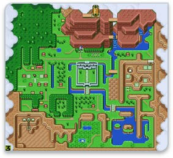
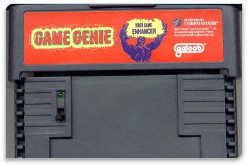

import { Split, SplitRight, Invert  } from 'mdx-deck/layouts'
import VideoPlayer from 'react-simple-video-player';
import { FullScreenCode } from 'mdx-deck/layouts'
import { Appear } from 'mdx-deck'

export { default as theme } from './theme'

# Bootstrap Your App with AWS Amplify
---
export default Invert

## Hello, my name is Mat Warger

- Decade of software experience
- Finance, marketing, insurance, sports industries 
- Startups and enterprise
- Currently @KeyholeSoftware in Kansas City
- Co-organizer JSKC
- Organizer @GraphQLKC

---
import { Image } from 'mdx-deck'

<Image src='plumbing.jpg' />
---
<VideoPlayer url="./auth_video.mp4" width={1280}
    height={960}/>
---
# What is Amplify?
- Client-side library from Amazon
- Authentication with Cognito
- API Gateway and Lambda
- AppSync for GraphQL
- Storage with S3 and DynamoDB
- Pinpoint for analytics and push notifications
- …and MORE
---
export default SplitRight

## Where is Amplify?
<ul>
  <Appear>
    <li>Open-source on Github</li>
    <li>Web - React, Angular, Vue, Vanilla</li>
    <li>Mobile – React Native, Android, and iOS</li>
    <li>Built with plugins and extensibility in mind</li>
    <li>Integration with AWS out of the box</li>
  </Appear>
</ul>
---
export default Split

## Why is Amplify?
<ul>
  <Appear>
    <li>Abstracts away common use-cases</li>
    <li>Centralized configuration</li>
    <li>Service provisioning</li>
    <li>CLI (amplify)</li>
    <li>Utility classes and components</li>
  </Appear>
</ul>

---
# Amplify CLI
## CloudFormation for the client
---
# Auth
## Cognito and Identity Pools  
#### (facebook/google/enterprise)
---
# API
## Lambda and GraphQL out of the box
#### (more on this later)
---
# Storage
## S3 and Dynamo FTW
---
# Hosting
## DEV vs PROD
---
# Resources

- https://github.com/mwarger/games-app-react
- https://github.com/mwarger/games-app-api
- https://aws.github.io/aws-amplify/
- @mwarger
